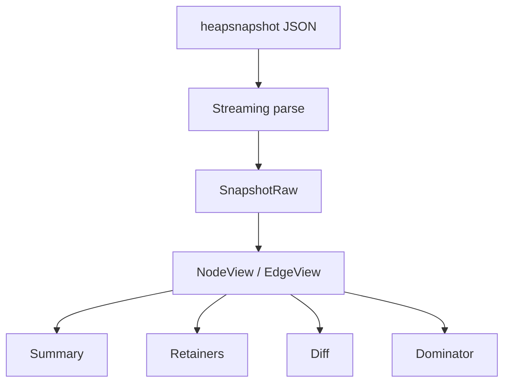

# HeapSnapshot 取り扱い概要（本ツール）

※ 公式な heapsnapshot 仕様書は存在せず、V8 の実装依存である点に注意する。

このドキュメントは、本ライブラリが **どの構造を前提にして読み取り**、
**内部でどのように変形/利用しているか**を簡潔にまとめたものです。

---

## 1. 入力構造（本ツールが前提とする最小形）

入力は **heapsnap の JSON 形式**（V8 heapsnapshot 由来）で、最小限以下のキーがあることを前提とします。

```json
{
  "snapshot": {
    "meta": {
      "node_fields": ["type", "name", "id", "self_size", "edge_count", "detachedness", ...],
      "node_types":  [...],
      "edge_fields": ["type", "name_or_index", "to_node", ...],
      "edge_types":  [...]
    }
  },
  "nodes":   [ ... ],
  "edges":   [ ... ],
  "strings": [ ... ]
}
```

### 具体例（heapsnap JSON / 最小スナップショット）

```json
{
  "snapshot": {
    "meta": {
      "node_fields": ["type", "name", "id", "self_size", "edge_count"],
      "node_types": [["synthetic","object"], "string", "number", "number", "number"],
      "edge_fields": ["type", "name_or_index", "to_node"],
      "edge_types": [["property"], "string_or_number", "node"]
    }
  },
  "nodes": [
    0, 0, 1, 0, 1,
    1, 1, 2, 42, 0
  ],
  "edges": [
    0, 2, 5
  ],
  "strings": ["GC roots", "FooStore", "store"]
}
```

#### 解説

`snapshot.meta` は **配列の解釈方法を定義するヘッダ**で、以下を使用します。

- `node_fields`:
  - `nodes` の **1レコード内のフィールド名**の並び
  - 例: `["type","name","id","self_size","edge_count"]`
- `node_types`:
  - `node_fields` と **同じ順序**で各フィールドの型情報を持つ
  - フィールド名が `type` の場合、それに対応する `node_types` は **enum 配列**
    - `node_fields[0] == "type"` の場合、 `nodes[0]`, `nodes[5]`, … の数値が **enum 配列の index** で、その `node` の型名を解決する
  - それ以外は `"string" / "number"` など **フィールドの型名**
- `edge_fields`:
  - `edges` の **1レコード内のフィールド名**の並び
  - 例: `["type","name_or_index","to_node"]`
- `edge_types`:
  - `edge_fields` と **同じ順序**で型情報を持つ
  - `edge_fields[i] == "type"` の場合、`edge_types[i]` は **enum 配列**
  - `name_or_index` は `"string_or_number"`（文字列参照 or 数値）
  - `to_node` は `"node"`（nodes 配列の開始位置）

- nodes は `node_fields` の数(=5)ごとに 1 ノード
  - node0: type=0("synthetic"), name=0("GC roots"), id=1, self_size=0, edge_count=1
  - node1: type=1("object"), name=1("FooStore"), id=2, self_size=42, edge_count=0
- edges は `edge_fields` の数(=3)ごとに 1 エッジ
  - edge0: type=0("property"), name_or_index=2("store"), to_node=5（node1の開始位置）

### 前提ルール（本ツール）

- `snapshot.meta` を **唯一の信頼情報**として参照
- `node_fields` / `edge_fields` は順序が意味を持つ
- `nodes` / `edges` は **フラット配列**（レコードの連結）として扱う
- `strings` は文字列テーブルで、`name` / `name_or_index` から参照される
- `*_types` は **\*_fields と同じ並び**で型が定義される
  - `*_fields` の `type` に対応する `*_types` は **配列(enum)** を前提とする
  - `nodes`/`edges` の `type` に対応する値は **その配列の index** を指し、型名を解決する

#### 参考

- [v8/heap-snapshot-generator.cc](https://chromium.googlesource.com/v8/v8.git/%2B/refs/heads/main/src/profiler/heap-snapshot-generator.cc#3641)

---

## 2. 内部表現（Raw + View）

入力 JSON をそのまま保持せず、以下の形に落とし込む。

```
SnapshotRaw
 ├─ nodes:   Vec<i64>
 ├─ edges:   Vec<i64>
 ├─ strings: Vec<String>
 └─ meta:    SnapshotMeta (+ index)

NodeView (index -> fields)
EdgeView (index -> fields)
```

### meta index の解決

`node_fields` / `edge_fields` の位置情報を index として保持し、
Node/Edge を配列参照で読み出せるようにする。

```
NodeView {
  type       = nodes[base + type_idx]
  name       = strings[nodes[base + name_idx]]
  id         = nodes[base + id_idx]
  self_size  = nodes[base + self_size_idx]
  edge_count = nodes[base + edge_count_idx]
}
```

```
EdgeView {
  type         = edges[base + type_idx]
  name_or_index= edges[base + name_or_index_idx]
  to_node      = edges[base + to_node_idx]
}
```

### 具体例（NodeView/EdgeView 解決）

```
node_fields = ["type","name","id","self_size","edge_count"]
node_types  = [["synthetic","object"], "string", "number", "number", "number"]

nodes (1ノード分):
  [type, name, id, self_size, edge_count]
  [  1 ,  1  , 2 ,    42    ,    0     ]

NodeView.name -> strings[1] = "FooStore"
NodeView.node_type -> node_types[0][1] = "object"
```

---

## 3. 変形・解析の流れ



### 3.1 Summary（Constructor Summary）

- 集計単位: `name`（constructor名）
- 集計内容:
  - `count`（インスタンス数）
  - `self_size_sum`
- 空 name は `node_type` の内訳を併記（Markdown出力のみ）

#### 具体例（Summary 出力）

入力ノード（name と self_size のみ抜粋）:

```
FooStore (self_size=42)
FooStore (self_size=5)
Bar      (self_size=100)
""       (self_size=7)
```

Markdown 出力例:

```md
| Constructor | Count | Self Size Sum |
| --- | ---: | ---: |
| Bar | 1 | 100 |
| FooStore | 2 | 47 |
| (empty; types: object=1) | 1 | 7 |
```

### 3.2 Retainers（保持経路）

- 逆辺（incoming edges）は必要時に **遅延構築**
- GC Root（`name == "GC roots"`）から target まで BFS
- 経路数・深さは制限可能

#### 具体例（Retainers 出力）

```md
- Retaining paths for FooStore (id=2)
  - Path #1
    - GC roots --(property)store--> FooStore
```

### 3.3 Diff（Summary 差分）

- Summary の結果を A/B で比較
- `count` / `self_size_sum` の差分を算出

#### 具体例（Diff 出力）

```md
| Constructor | Count A | Count B | Δ Count | Self Size A | Self Size B | Δ Self Size |
| --- | ---: | ---: | ---: | ---: | ---: | ---: |
| FooStore | 10 | 12 | 2 | 2048 | 3072 | 1024 |
```

### 3.4 Dominator（簡易）

- グラフ全体から即時支配者（IDOM）を計算
- `target` への dominator chain を生成

#### 具体例（Dominator 出力）

```md
- Dominator chain for FooStore (id=2)
  - #1 GC roots (id=1)
  - #2 FooStore (id=2)
```

---

## 4. 出力変形（Markdown / JSON / CSV）

### Markdown

- Summary: 表形式
- Retainers/Dominator: ツリー形式
- 長文は `<details>` で省略・展開
- Markdown 崩れ防止のため一部の文字をエスケープ

#### 具体例（長文の省略）

```md
| <details><summary>query ($filter: ... ) …</summary><div>query ($filter: ...) { ... }</div></details> | 4810 | 8734960 |
```

※ 空白が 1 文字ずつ分断されている場合は「連結補正」を行う。

### JSON

- スキーマは `docs/schema.md` に固定
- `version` フィールドで将来拡張を管理

### CSV

- Summary / Diff のみ対応

---

## 5. 重要な前提と注意点

- **公式仕様は無い**ため、`meta` を唯一の信頼情報として扱う
- `nodes` / `edges` の一括デシリアライズは禁止（OOM回避）
- 文字列に不正なサロゲートが含まれる場合は `U+FFFD` に正規化
- DevTools と完全一致の表示は保証しない（本ツールの出力規約に従う）
